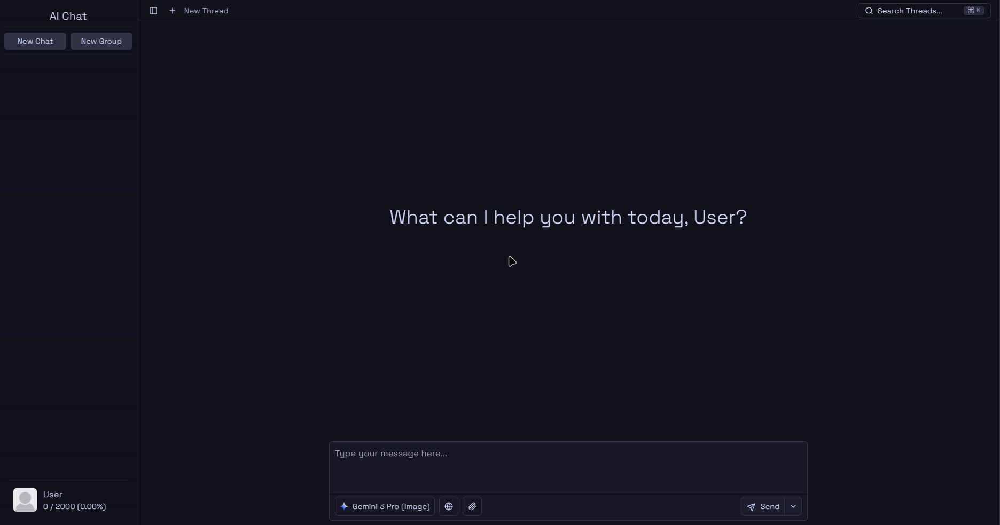

# AI Chat

[](https://opensource.org/licenses/MIT)

An advanced AI chat application with streaming responses, thread organization, attachments, AI profiles, and a settings-driven experience.



## Highlights / Features

### Chat experience

- **Streaming assistant responses (SSE)** with **Abort** support and **resumable streams** (server resumes by `streamId`) via Redis-backed [`resumable-stream`](https://www.npmjs.com/package/resumable-stream).
- **Threaded conversations** with:
  - Create new threads
  - Rename threads (including AI-assisted title regeneration)
  - Pin threads
  - Search threads by title
- **Conversation branching**: branch a thread at an earlier assistant message to explore alternate paths.

### Attachments

- **Drag & drop** support for attachments (currently **images + PDFs**).
- Attachments are stored in **Cloudflare R2 (via Convex R2 integration)** and surfaced via:
  - Images: `https://ik.imagekit.io/gmethsnvl/ai-chat/...`
  - Files (e.g. PDFs): `https://files.chat.asakuri.me/...`
- **Attachments management page**: filter/search/sort and bulk delete.

### AI Profiles + Customization

- **AI Profiles**: save reusable personas / system prompts (with optional profile image).
- **Customization settings**:
  - “About you” (name/occupation) + traits
  - Global system instruction
  - Background image (uploaded to R2, displayed via ImageKit)
  - UI behavior toggles (e.g. disable blur, show full code blocks)
  - Hide models from the model picker

### Safety + Ops

- **Per-user usage limits** (daily/monthly semantics) with automatic enforcement.
- **Statistics dashboard**: activity calendar, model usage ranking, thread ranking, profile usage ranking.
- **Observability**:
  - Axiom logging
  - Vercel Analytics + Speed Insights (enabled in production)

## Architecture (high level)

- **Web app**: Vite + TanStack Start (SSR) running on port `3000` in dev.
- **Backend**:
  - **Convex** for persistence and application data (threads, messages, attachments metadata, profiles, users, usage limits, stats).
  - **Standalone Hono server** for the AI streaming endpoint:
    - `POST /api/ai/chat` → streams responses (SSE)
    - `GET /api/ai/chat?streamId=...` → resumes an existing stream

## Tech Stack

### Frontend

- **React** + **TypeScript**
- **TanStack Start** (SSR) + **TanStack Router** + **TanStack Query**
- **Tailwind CSS v4**
- **shadcn/ui** component system
- **sonner** for toast notifications
- **@dnd-kit** for drag & drop thread grouping
- **streamdown + shiki** for streaming-friendly markdown + code rendering
- **KaTeX** for math rendering
- **@nivo/calendar** for statistics visualization

### Backend / Infrastructure

- **Convex** (database + serverless functions)
- **WorkOS AuthKit** for authentication
- **Hono** server for AI API + streaming
- **Vercel AI SDK** (`ai`) with provider integrations:
  - OpenAI (`@ai-sdk/openai`)
  - Google Gemini (`@ai-sdk/google`)
  - DeepSeek (`@ai-sdk/deepseek`)
- **Redis** (via `ioredis`) for resumable streaming
- **Cloudflare R2** (via `@convex-dev/r2`) for file storage
- **ImageKit** CDN for image delivery
- **Docker** (Bun base image)

## Local Development

### Prerequisites

- **Bun** (recommended)
- A **Convex** project (deployment) and required keys
- A **Redis** instance (for resumable streams)
- WorkOS AuthKit configuration (client + API keys)
- Proxy endpoint + key for model providers (see env vars below)

### Install

```bash
bun install
```

### Environment variables

This project validates env vars in `src/env.js`. You’ll need both server and client variables.

Server-side:

- `NODE_ENV` (`development` or `production`)
- `CONVEX_DEPLOYMENT`
- `PROXY_URL`
- `PROXY_KEY`
- `EXA_API_KEY`
- `REDIS_URL`
- `WORKOS_API_KEY`
- `WORKOS_CLIENT_ID`
- `WORKOS_REDIRECT_URI`
- `WORKOS_COOKIE_PASSWORD`

Client-side (must be prefixed with `VITE_`):

- `VITE_CONVEX_URL`
- `VITE_AXIOM_TOKEN`
- `VITE_AXIOM_DATASET`
- `VITE_API_ENDPOINT` (base URL for the Hono server; see below)

### Run (dev)

1. Start the web app (port `3000`):

```bash
bun dev
```

2. Start the AI API server (port `3001`):

```bash
bun dev:server
```

In development, set:

- `VITE_API_ENDPOINT=http://localhost:3001`

### Production notes (as implemented)

The current implementation assumes:

- Web app origin: `https://chat.asakuri.me`
- Files origin: `https://files.chat.asakuri.me`
- Image CDN: `https://ik.imagekit.io/gmethsnvl/ai-chat`
- Hono server listens on `PORT` (defaults to `3001`) and exposes `/api/ai/chat`.

CORS for `/api/*` is configured to allow:

- `http://localhost:3000` in development
- `https://chat.asakuri.me` in production

## Scripts

From `package.json`:

- `bun dev` — start Vite dev server
- `bun build` — build
- `bun preview` — build and preview
- `bun dev:server` — run the Hono API server in watch mode
- `bun check` — run lint + typecheck
- `bun lint` / `bun lint:fix`
- `bun typecheck`

## License

Distributed under the MIT License. See `LICENSE` for more information.
