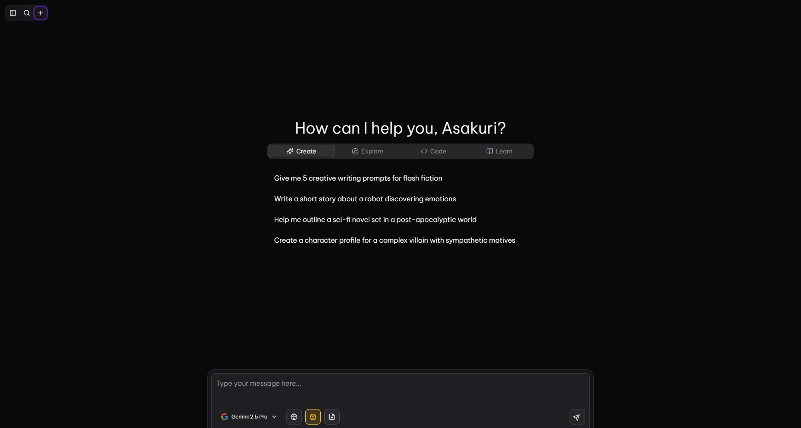

# AI Chat

[](https://opensource.org/licenses/MIT)

An advanced AI chat application built with the T3 stack, featuring a modern UI and a rich feature set.




## Features

- **Real-time Chat:** Instantaneous message streaming and updates.
- **Thread Management:** Organize conversations with threads.
- **Message History:** View, edit, and delete messages.
- **Model Switching:** Change the AI model on the fly.
- **File Attachments:** Send and receive images, PDFs, and other files.
- **Conversation Branching:** Create different branches of a conversation.
- **Customizable UI:** Light and dark modes, and customizable system prompts.
- **And much more...**

## Tech Stack

- **Framework:** [Next.js](https://nextjs.org/)
- **Styling:** [Tailwind CSS](https://tailwindcss.com/)
- **UI Components:** [shadcn/ui](https://ui.shadcn.com/)
- **State Management:** [Zustand](https://github.com/pmndrs/zustand)
- **Database:** [Convex](https://www.convex.dev/)
- **Authentication:** [Clerk](https://clerk.com/)
- **AI SDK:** [Vercel AI SDK](https://sdk.vercel.ai/docs)

## Getting Started

To get a local copy up and running, follow these simple steps.

### Prerequisites

- Node.js (v18 or later)
- npm, yarn, or bun

### Installation

1.  Clone the repo
    ```sh
    git clone https://github.com/noki-asakuri/ai-chat.git
    ```
2.  Install NPM packages
    ```sh
    npm install
    ```
3.  Set up your environment variables. Create a `.env.local` file in the root of your project and add the following:

    ```
    NEXT_PUBLIC_CONVEX_URL=
    NEXT_PUBLIC_CLERK_PUBLISHABLE_KEY=
    NEXT_PUBLIC_CLERK_SIGN_IN_URL=/sign-in
    NEXT_PUBLIC_CLERK_SIGN_UP_URL=/sign-up
    NEXT_PUBLIC_CLERK_AFTER_SIGN_IN_URL=/
    NEXT_PUBLIC_CLERK_AFTER_SIGN_UP_URL=/
    CLERK_SECRET_KEY=
    ```

4.  Run the development server
    ```sh
    npm run dev
    ```

## Roadmap

- [x] Add support for streaming
- [x] Add support for resuming streaming
- [x] Add thread support
- [x] Better markdown support
- [x] Support edit and delete messages
- [x] Add support to change model
- [x] Add authentication
- [x] Support send Image/PDF/etc
- [x] Support branching
- [x] Use shadcn/ui side-bar for threads
- [x] Custom system prompts
- [x] Add support to change model params
- [x] Drag and drop files
- [ ] Better UI
- [x] Add Settings page
  - [x] Account
  - [x] Statistics
  - [x] Customize
  - [x] Attachments
  - [x] Models
  - [x] AI Profiles
- [x] Profile selection
- [x] Remove attachments on messages.
- [x] Ratelimit per user
- [ ] Allow annonymous access (with lower ratelimit)
- [ ] Switch to use Better-Auth for auth
- [ ] Add pricing and subscription tier
- [ ] Image generation support
  - [x] Google Gemini Image Gen
  - [ ] OpenAI GPT Image 1
- [x] Sub-model params (for model using reasoning effort 'high', 'medium', 'low')
- [x] Switch to using same format from budget to effort for Gemini models (low: 10%, medium: 25%, high: 50%)
- [ ] Custom grouping of threads
  - [ ] Drag and drop threads to group them
  - [ ] Create new group
  - [ ] Rename group
  - [ ] Delete group
  - [ ] Reorder groups
  - [ ] Reorder threads within group
  - [ ] Reorder threads between groups
  - [ ] Pin group to top

## License

Distributed under the MIT License. See `LICENSE` for more information.

## Acknowledgments

- [T3 Stack](https://create.t3.gg/)
- [shadcn/ui](https://ui.shadcn.com/)
- [Vercel](https://vercel.com/)
- [Convex](https://www.convex.dev/)
- [Clerk](https://clerk.com/)
